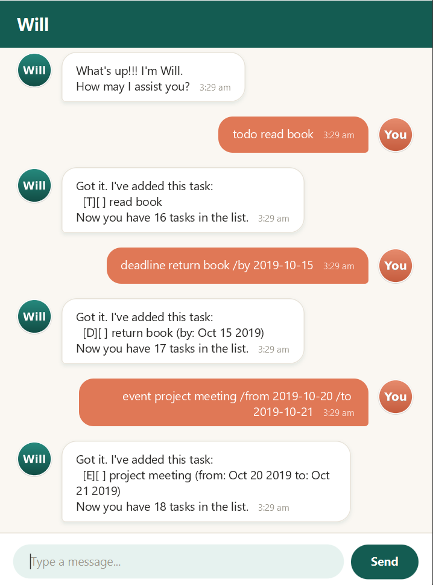

# Will User Guide

Will is a desktop chatbot for tracking your todos, deadlines, and events —
optimized for use via a Command Line Interface (CLI) while still having the
benefits of a Graphical User Interface (GUI).

## Quick start

1. Ensure you have Java `25` or above installed on your computer.
2. Download the latest `will.jar` from [here](https://github.com/HienPahm/ip/releases).
3. Copy the file to the folder you want to use as the home folder for Will.
4. Open a command terminal, `cd` into the folder you put the jar file in, and use the
   `java -jar will.jar` command to run the application. A GUI similar to the one below
   should appear in a few seconds.

   
5. Type a command in the command box and press Enter to execute it. e.g. typing
   `list` and pressing Enter will list all your tasks.
6. Refer to the [Features](#features) below for details of each command.

## Features

> **Notes about the command format**
> * Words in `UPPER_CASE` are the parameters to be supplied by you, e.g. in
>   `todo DESCRIPTION`, `DESCRIPTION` is a parameter which can be used as
>   `todo read book`.
> * Dates can be given as `yyyy-MM-dd` (e.g. `2019-10-15`) to be recognized and
>   displayed nicely (e.g. `Oct 15 2019`); any other text is kept as-is.

### Adding a todo: `todo`

Adds a todo (a task with no date attached) to the list.

Format: `todo DESCRIPTION`

Example: `todo read book`

```
Got it. I've added this task:
  [T][ ] read book
Now you have 1 tasks in the list.
```

### Adding a deadline: `deadline`

Adds a task that needs to be done by a specific date/time.

Format: `deadline DESCRIPTION /by WHEN`

Example: `deadline return book /by 2019-10-15`

```
Got it. I've added this task:
  [D][ ] return book (by: Oct 15 2019)
Now you have 2 tasks in the list.
```

### Adding an event: `event`

Adds a task that spans a period of time.

Format: `event DESCRIPTION /from START /to END`

Example: `event project meeting /from 2019-10-20 /to 2019-10-21`

```
Got it. I've added this task:
  [E][ ] project meeting (from: Oct 20 2019 to: Oct 21 2019)
Now you have 3 tasks in the list.
```

If the new event's date range overlaps with an existing event already in your
list, Will lets you know right after adding it — it doesn't block the add,
since an intentional overlap (e.g. two optional events) is still valid:

```
Note: this clashes with 1 other task already in your list:
  [E][ ] project meeting (from: Oct 20 2019 to: Oct 21 2019)
```

### Listing all tasks: `list`

Shows a list of all tasks currently tracked.

Format: `list`

### Viewing tasks on a date: `on`

Shows every task (deadline or event) that falls on a given date.

Format: `on DATE`

Example: `on 2019-10-15`

### Finding tasks: `find`

Finds tasks whose description contains the given keyword.

Format: `find KEYWORD`

Example: `find book`

### Marking a task as done: `mark`

Marks the specified task as done.

Format: `mark INDEX`

Example: `mark 2` marks the 2nd task in the list as done.

### Marking a task as not done: `unmark`

Marks the specified task as not done.

Format: `unmark INDEX`

### Deleting a task: `delete`

Deletes the specified task from the list.

Format: `delete INDEX`

Example: `delete 3` deletes the 3rd task in the list.

### Exiting the program: `bye`

Exits the program.

Format: `bye`

### Saving the data

Will's task list is saved automatically to disk after every command that
changes it — there is no need to save manually.

## Command summary

| Action | Format | Example |
|---|---|---|
| Todo | `todo DESCRIPTION` | `todo read book` |
| Deadline | `deadline DESCRIPTION /by WHEN` | `deadline return book /by 2019-10-15` |
| Event | `event DESCRIPTION /from START /to END` | `event meeting /from 2019-10-20 /to 2019-10-21` |
| List | `list` | `list` |
| On | `on DATE` | `on 2019-10-15` |
| Find | `find KEYWORD` | `find book` |
| Mark | `mark INDEX` | `mark 2` |
| Unmark | `unmark INDEX` | `unmark 2` |
| Delete | `delete INDEX` | `delete 3` |
| Bye | `bye` | `bye` |
